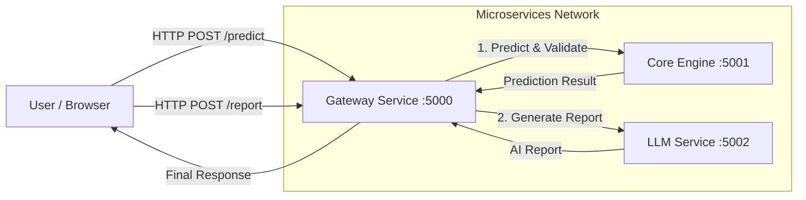

# NeuroRide Guardian - Project Flow

This document outlines the architecture and data flow of the **NeuroRide Guardian** application, which uses a microservices approach.

## 🔄 High-Level Architecture

The system is composed of a Frontend and three backend Microservices.



## 🌊 Detailed Data Flow

Here is the step-by-step journey of the application workflows:

### Workflow 1: Prediction
1.  **User Interaction**: User fills out vehicle data on `index.html` and clicks "Predict Maintenance Need".
2.  **Gateway (Port 5000)**: Receives `POST /predict`.
3.  **Core Engine (Port 5001)**:
    *   Gateway forwards data to `:5001/predict`.
    *   **Validation**: Checks thresholds (e.g., tire pressure > 0). Returns error if invalid.
    *   **Prediction**: If valid, runs Random Forest model.
    *   **Output**: Returns prediction (Yes/No), confidence, and risk factors.
4.  **Response**: Gateway returns the JSON result to the frontend.

### Workflow 2: AI Report Generation
1.  **User Interaction**: After a prediction, user clicks "Generate Detailed AI Report".
2.  **Gateway (Port 5000)**: Receives `POST /report` containing vehicle data and the prediction result.
3.  **LLM Service (Port 5002)**:
    *   Gateway forwards data to `:5002/generate_report`.
    *   **Prompting**: Constructs a prompt for the Gemini AI, including industry standards.
    *   **Inference**: Generates a detailed technical analysis, summary, and recommendations.
4.  **Response**: Gateway returns the JSON report (Summary + Full Markdown) to the frontend.

## 🛠️ Service Ports Reference

| Service | Port | Endpoint | Purpose |
|---------|------|----------|---------|
| **Gateway** | `5000` | `/predict`, `/report` | Main API for frontend |
| **Core Engine** | `5001` | `/predict` | Validation & ML Inference |
| **LLM Service** | `5002` | `/generate_report` | Generates AI summaries & reports |

## 🚀 Request/Response Examples

### Prediction Request (Frontend -> Gateway)
```json
{
  "tire_pressure": 25,
  "usage_hours": 4000,
  ...
}
```

### Prediction Response
```json
{
  "maintenance_required": 1,
  "confidence": 85.5,
  "risk_factors": ["Low tire pressure"]
}
```

### Report Request (Frontend -> Gateway)
```json
{
  "vehicle_data": { ... },
  "prediction_result": { ... }
}
```

### Report Response
```json
{
  "summary": ["Critical issue with brakes", ...],
  "full_report": "## Vehicle Information\n..."
}
```
