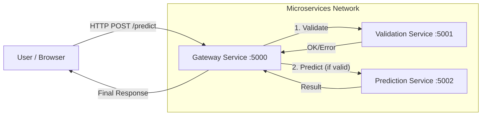

# Vehicle Maintenance Predictor - Project Flow

This document outlines the architecture and data flow of the Vehicle Maintenance Predictor application, which uses a microservices approach.

## 🔄 High-Level Architecture

The system is composed of a Frontend and three backend Microservices.



## 🌊 Detailed Data Flow

Here is the step-by-step journey of a single prediction request:

### 1. User Interaction (Frontend)
*   **Action**: User fills out the form (Year, Usage Hours, Tire Pressure, etc.) on `index.html`.
*   **Trigger**: User clicks "Predict Maintenance Need".
*   **Process**: `script.js` collects the data, formats it as JSON, and sends a `POST` request to the Gateway.

### 2. Gateway Orchestration (Port 5000)
*   **Role**: The Entry Point and Orchestrator.
*   **Action**: Receives the request at `http://localhost:5000/predict`.
*   **Step A (Validation)**: 
    *   The Gateway forwards the data to the **Validation Service** (`:5001/validate`).
    *   If the Validation Service returns an error (e.g., negative tire pressure), the Gateway stops and returns a `400 Bad Request` to the frontend immediately.
    *   If valid, it receives any "Risk Factors" identified by the validation logic.
*   **Step B (Prediction)**:
    *   If validation passes, the Gateway forwards the data to the **Prediction Service** (`:5002/predict`).
    *   The Prediction Service runs the Random Forest model and returns the prediction (Maintenance Required: Yes/No) and confidence score.
*   **Step C (Aggregation)**:
    *   The Gateway combines the **Prediction Result** and the **Risk Factors** into a single JSON response.

### 3. Validation Service (Port 5001)
*   **Role**: Quality Assurance.
*   **Logic**: Checks if inputs are within realistic physical bounds (defined in `thresholds.py`).
*   **Output**: 
    *   Status: `valid` or `invalid`.
    *   Risk Factors: Warnings like "Low Tire Pressure" even if the values are technically valid but suboptimal.

### 4. Prediction Service (Port 5002)
*   **Role**: Intelligence.
*   **Logic**: Loads the pre-trained `maintenance_rf_model.pkl`.
*   **Process**: Preprocesses the input (handling missing values, scaling) and feeds it into the Random Forest Classifier.
*   **Output**: Probability of failure and maintenance classification.

### 5. Result Display (Frontend)
*   **Action**: `script.js` receives the final JSON response.
*   **Visuals**:
    *   Updates the UI to show "Maintenance Required" (Red) or "No Maintenance Needed" (Green).
    *   Lists any specific **Risk Factors** returned by the system.
    *   Shows the **Confidence Score**.

## 🛠️ Service Ports Reference

| Service | Port | Endpoint | Purpose |
|---------|------|----------|---------|
| **Gateway** | `5000` | `/predict` | Main API for frontend |
| **Validation** | `5001` | `/validate` | Checks data integrity |
| **Prediction** | `5002` | `/predict` | Runs ML inference |

## 🚀 Request/Response Example

**Request (Frontend -> Gateway):**
```json
{
  "tire_pressure": 25,
  "usage_hours": 4000,
  ...
}
```

**Internal Response (Validation -> Gateway):**
```json
{
  "status": "valid",
  "risk_factors": ["Low tire pressure (25 PSI)"]
}
```

**Internal Response (Prediction -> Gateway):**
```json
{
  "maintenance_required": 0,
  "confidence": 85.5
}
```

**Final Response (Gateway -> Frontend):**
```json
{
  "maintenance_required": 0,
  "confidence": 85.5,
  "risk_factors": ["Low tire pressure (25 PSI)"]
}
```
