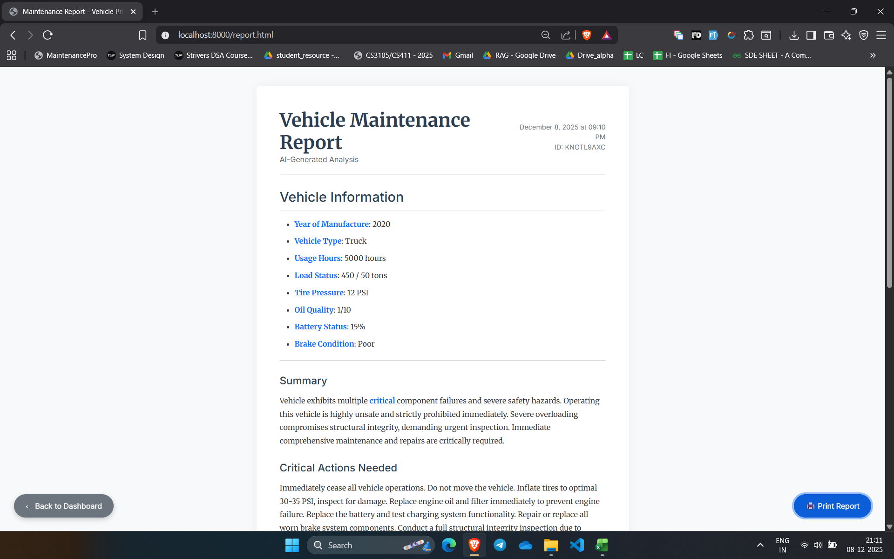

# NeuroRide Guardian

**AI-Powered Vehicle Maintenance and Scheduling System**

NeuroRide Guardian is a comprehensive microservices-based system designed to automate vehicle maintenance, from real-time telemetry ingestion to predictive analysis and appointment scheduling. It leverages machine learning for predictive maintenance and generative AI for creating human-readable technical reports.


---

## System Flow and Architecture

The system operates through a coordinated workflow of seven distinct microservices, ensuring modularity, scalability, and ease of maintenance.

### 1. Data Ingestion
The **Telemetry Service** acts as the ingestion point for all vehicle sensor data. It supports both real-time streaming from connected vehicles and bulk CSV imports for historical analysis.
- **Real-time Processing:** Immediately evaluates incoming telemetry against critical safety thresholds (e.g., Oil Quality below 3.0, dangerously low tire pressure).
- **Maintenance Flagging:** Automatically generates a "Maintenance Flag" when critical issues are detected, triggering the downstream workflow without human intervention.
- **Streaming Simulator:** Includes a built-in simulator to generate realistic vehicle behavior for testing and demonstration purposes.


### 2. Prediction and Assessment
When a potential issue is flagged or a user requests a check, the system performs a deep analysis via the **Gateway**.
- **Core Engine:** Executes a pre-trained Random Forest Machine Learning model to calculate the specific probability of maintenance requirements based on multivariate risk factors.
- **LLM Service:** Integrates with Google Gemini to synthesize the raw telemetry data and ML confidence scores into a professional, easy-to-understand technical report for the vehicle owner.



### 3. Forecasting and Planning
To optimize service center operations, the **Forecasting Service** analyzes data trends.
- **Demand Prediction:** Uses historical booking data and current active maintenance flags to predict service demand for the upcoming week.
- **Capacity Analysis:** Calculates the utilization rates of service bays to identify potential bottlenecks or underutilized resources in specific regions.

### 4. Orchestration and Scheduling
The **Orchestrator** manages the end-to-end automation lifecycle.
- **Workflow Automation:** Triggers the full maintenance cycle—collecting forecasts, identifying flagged vehicles, and initiating the scheduling process.
- **Smart Scheduling:** The **Scheduling Service** employs a weighted Priority Algorithm. It assigns appointment slots by considering the severity of the defect, the customer's tier (e.g., Premium vs. Standard), and the geographical proximity to the service center.
- **Booking Management:** Automatically creates and confirms provisional bookings based on optimal slot availability.


### 5. Notification
Once an appointment is successfully scheduled, the Orchestrator triggers the notification system to send a confirmation (simulated SMS/Email) to the vehicle owner, completing the automation loop.

---

## Service Documentation

Detailed technical documentation for each microservice is available below:

| Service | Port | Description | Documentation |
| :--- | :--- | :--- | :--- |
| **Gateway** | 5000 | Main API Entry Point | [View Docs](documentation/services/gateway.md) |
| **Core Engine** | 5001 | ML Prediction and Validation | [View Docs](documentation/services/core_engine.md) |
| **LLM Service** | 5002 | AI Report Generation | [View Docs](documentation/services/llm_service.md) |
| **Scheduling** | 5003 | Appointment Management | [View Docs](documentation/services/scheduling.md) |
| **Forecasting** | 5004 | Demand Prediction | [View Docs](documentation/services/forecasting.md) |
| **Orchestrator** | 5005 | Workflow Automation | [View Docs](documentation/services/orchestrator.md) |
| **Telemetry** | 5006 | Data Ingestion and Simulator | [View Docs](documentation/services/telemetry_ingestion.md) |

---

## Setup Guide

Follow these steps to deploy the system locally.

### 1. Prerequisites
- **Python 3.8 or higher**
- **Google Gemini API Key** (Optional, required only for AI Report features)

### 2. Installation
Install the necessary Python dependencies using pip:
```bash
pip install Flask Flask-CORS Flask-SQLAlchemy requests google-generativeai scikit-learn
```

### 3. Database Initialization
Initialize the SQLite database and populate it with seed data (vehicles, service centers, and technicians):
```bash
python database/seed_data.py
```

### 4. Configuration
To enable the AI Report generation capabilities, set your Google Gemini API key as an environment variable:

**Windows PowerShell:**
```powershell
$env:GEMINI_API_KEY='your_api_key_here'
```

**Linux/Mac:**
```bash
export GEMINI_API_KEY='your_api_key_here'
```

### 5. Running the System
Use the unified service manager script to launch all microservices simultaneously. This script will spawn separate console windows for each service and monitor their health.

```bash
python run_services.py
```

---

## Frontend Dashboards

Access the user interfaces via your web browser:

### Main Dashboard
**URL:** `frontend/index.html`
The primary interface for vehicle owners and service advisors to input telemetry manually, trigger predictions, and view the AI-generated assessment reports.

### Admin Dashboard
**URL:** `frontend/admin.html`
A control center for system administrators. From here, you can start/stop the telemetry simulator, trigger the orchestration workflow, and view system-wide analytics and forecasts.


### Simulator and Telemetry Controls
**Accessed via Admin Dashboard**
Monitor the ingestion of real-time data streams and visualize the status of the connected vehicle fleet.


### Bookings Management
**URL:** `frontend/bookings.html`
A dedicated interface for service center staff to view, filter, and manage scheduled service appointments.

---

## Project Structure

```
maintenance-predictor/
├── documentation/       # Detailed service documentation and screenshots
│   ├── services/        # Markdown docs for individual services
│   └── screenshots/     # System screenshots
├── microservices/       # Source code for all 7 microservices
│   ├── gateway/
│   ├── core_engine/
│   ├── llm_service/
│   ├── scheduling/
│   ├── forecasting/
│   ├── orchestrator/
│   └── telemetry_ingestion/
├── frontend/            # HTML/JS/CSS Dashboards
├── database/            # Database models and seed scripts
├── run_services.py      # Unified startup script
└── README.md            # Project documentation
```
