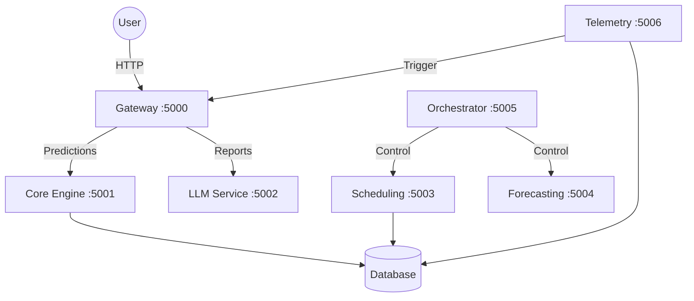

# System Architectural Logic Documentation

This directory contains detailed technical documentation for each microservice in the NeuroRide Guardian system.

## Service Map

| Service | File | Role | Port |
|---------|------|------|------|
| **Gateway** | [01_gateway_service.md](./01_gateway_service.md) | Entry Point / Routing | 5000 |
| **Core Engine** | [02_core_engine.md](./02_core_engine.md) | ML Predictions | 5001 |
| **LLM Service** | [03_llm_service.md](./03_llm_service.md) | Generative AI Reports | 5002 |
| **Scheduling** | [04_scheduling_service.md](./04_scheduling_service.md) | Allocations & Logistics | 5003 |
| **Forecasting** | [05_forecasting_service.md](./05_forecasting_service.md) | Demand Prediction | 5004 |
| **Orchestrator** | [06_orchestrator_service.md](./06_orchestrator_service.md) | Workflow Manager | 5005 |
| **Telemetry** | [07_telemetry_service.md](./07_telemetry_service.md) | Data Ingestion & Sims | 5006 |

## System Data Flow

