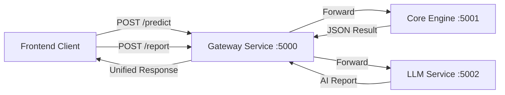

# Gateway Service Documentation

## 1. Overview
The **Gateway Service** acts as the central entry point for the NeuroRide Guardian backend. It follows the **API Gateway Pattern**, responsible for routing client requests to the appropriate microservices (Core Engine and LLM Service). It also handles Cross-Origin Resource Sharing (CORS) to allow secure communication with the frontend.

## 2. Architecture & Logic

### 2.1 Technology Stack
*   **Framework**: Flask (Python)
*   **Port**: 5000
*   **Key Libraries**: `flask-cors`, `requests`

### 2.2 Core Logic
The service does not perform business logic itself. Instead, it acts as a **Reverse Proxy**:
1.  **Receives Request**: Accepts HTTP POST calls from the frontend (e.g., `/predict` or `/report`).
2.  **Routing**: Determines which downstream service handles the request.
3.  **Forwarding**: Uses the `requests` library to send the internal call to the specific microservice port (e.g., Core Engine on 5001).
4.  **Response Handling**: Receives the response from the microservice and relays it back to the client.
5.  **Health Check**: It aggregates the health status of its dependent services.

### 2.3 Data Flow Diagram



## 3. Endpoints & API Reference

### 1. Unified Health Check
*   **Endpoint:** `/health`
*   **Method:** `GET`
*   **Description:** Checks if the Gateway is running and verifies connectivity to downstream services.
*   **Logic:**
    *   Tries to ping `http://localhost:5001/health` (Core Engine).
    *   Tries to ping `http://localhost:5002/health` (LLM Service).
    *   Returns a status summary.
*   **Response:**
    ```json
    {
        "status": "active",
        "service": "api_gateway",
        "downstream_services": {
            "core_engine": "healthy",
            "llm_service": "healthy"
        }
    }
    ```

### 2. Maintenance Prediction Proxy
*   **Endpoint:** `/predict`
*   **Method:** `POST`
*   **Description:** Forwards vehicle data to the Core Engine for maintenance prediction.
*   **Target:** `http://localhost:5001/predict`
*   **Request Body:**
    ```json
    {
        "features": [0.85, 45000, 75, 4.2] 
        // [engine_load, mileage, battery_level, oil_quality]
    }
    ```

### 3. AI Report Generation Proxy
*   **Endpoint:** `/report`
*   **Method:** `POST`
*   **Description:** Forwards prediction results to the LLM Service to generate a human-readable explanation.
*   **Target:** `http://localhost:5002/generate_report`
*   **Request Body:**
    ```json
    {
        "vehicle_id": "V001",
        "prediction_data": { ...Result from /predict... }
    }
    ```

## 4. Key Code Implementation (Snippet)
```python
@app.route('/predict', methods=['POST'])
def predict():
    """Route to Core Engine"""
    try:
        # 1. Forward request to Core Engine running on port 5001
        response = requests.post('http://localhost:5001/predict', json=request.json)
        # 2. Return the downstream response
        return jsonify(response.json()), response.status_code
    except requests.exceptions.ConnectionError:
        return jsonify({'error': 'Core Engine service unavailable'}), 503
```
