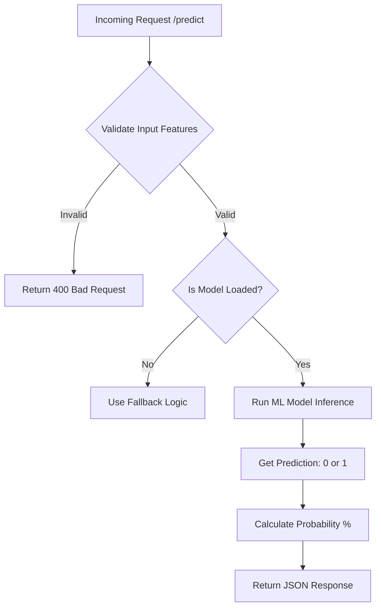

# Core Engine Service Documentation

## 1. Overview
The **Core Engine** is the analytical heart of NeuroRide Guardian. It is responsible for processing vehicle telemetry data and using a pre-trained Machine Learning model (`model.pkl`) to predict the likelihood of maintenance requirements. It also enforces strict data validation to ensure input integrity.

## 2. Architecture & Logic

### 2.1 Technology Stack
*   **Framework**: Flask (Python)
*   **Port**: 5001
*   **ML Library**: `scikit-learn` (joblib for model loading)
*   **Key Files**: `app.py`, `model.pkl`

### 2.2 Core Logic
The service operates in three distinct stages:
1.  **Initialization**: On startup, it attempts to load the `model.pkl` file (Random Forest Classifier). If not found, it initializes a dummy fallback model for safety.
2.  **Input Validation**: Before prediction, incoming data is checked against defined thresholds (e.g., Engine Load must be between 0 and 1) to reject anomalous data.
3.  **Inference**: Valid features are passed to the model's `.predict()` and `.predict_proba()` methods to determine if maintenance is needed and the confidence level.

### 2.3 Logic Flow


## 3. Endpoints & API Reference

### 1. Predict Maintenance
*   **Endpoint:** `/predict`
*   **Method:** `POST`
*   **Request Body:**
    ```json
    {
        "features": [engine_load, mileage, battery_level, oil_quality]
    }
    ```
*   **Logic Detail:**
    *   **Validation Rules:**
        *   `features` list must have exactly 4 elements.
        *   `engine_load`: 0.0 to 1.0
        *   `mileage`: >= 0
        *   `battery_level`: 0 to 100
        #   `oil_quality`: 0.0 to 10.0
    *   **Prediction:** Returns `maintenance_needed` (bool) and `confidence` (float).
*   **Success Response:**
    ```json
    {
        "maintenance_needed": true,
        "confidence": 0.87,
        "risk_level": "high",
        "input_features": [...]
    }
    ```

### 2. Health Check
*   **Endpoint:** `/health`
*   **Method:** `GET`
*   **Description:** Returns status and confirms if the ML model is successfully loaded.

## 4. Key Code Implementation (Validation)
```python
def validate_input(features):
    """
    Validates input features range
    Order: [Engine Load, Mileage, Battery, Oil]
    """
    if len(features) != 4:
        return False, "Expected 4 features"
        
    engine_load, mileage, battery, oil = features
    
    if not (0 <= engine_load <= 1):
        return False, "Engine load must be between 0 and 1"
    if mileage < 0:
        return False, "Mileage cannot be negative"
        
    return True, "Valid"
```
