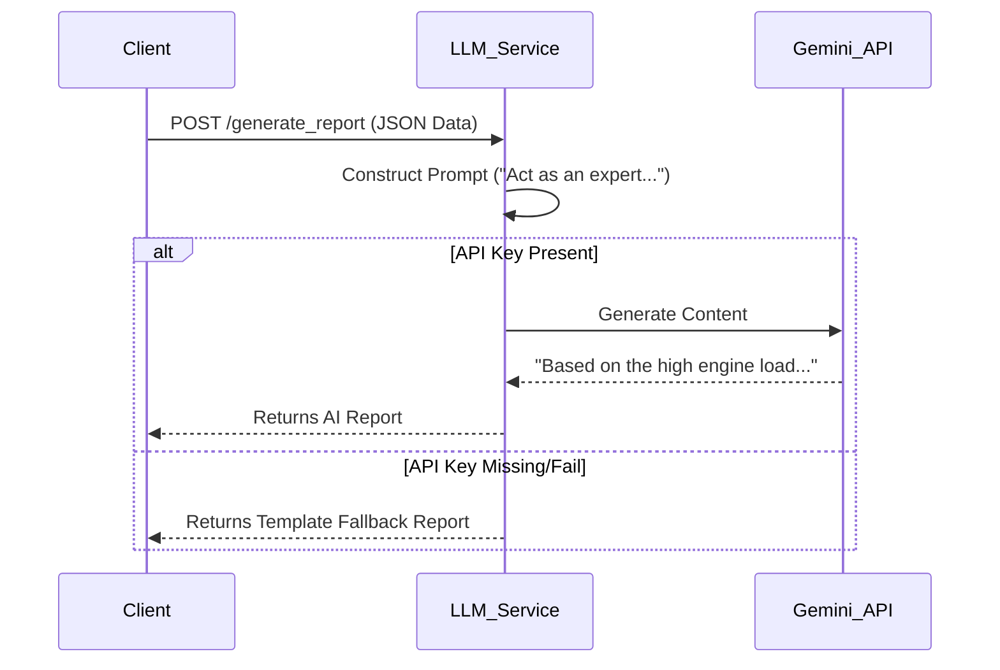

# LLM Service Documentation

## 1. Overview
The **LLM Service** leverages Generative AI (specifically Google Gemini Pro) to convert raw technical data into human-readable maintenance reports. It transforms binary predictions and numerical features into actionable advice for technicians and vehicle owners.

## 2. Architecture & Logic

### 2.1 Technology Stack
*   **Framework**: Flask (Python)
*   **Port**: 5002
*   **AI Model**: Google Gemini Pro (`gemini-pro`)
*   **Library**: `google-generativeai`
*   **Environment Variable**: `GEMINI_API_KEY` (Required)

### 2.2 Core Logic
The service functions as a specialized text completion engine:
1.  **Context Assembly**: It receives structured JSON data containing vehicle stats and prediction results.
2.  **Prompt Engineering**: This data is injected into a carefully crafted prompt template that instructs the AI to act as a "Senior Vehicle Maintenance Expert".
3.  **API Call**: The prompt is sent to Google's Gemini API.
4.  **stream handling**: (Internal implementation detail) It waits for the full response generated by the model.
5.  **Markdown Formatting**: The AI is instructed to return the report in Markdown format for easy frontend rendering.

### 2.3 Logic Flow


## 3. Endpoints & API Reference

### 1. Generate Maintenance Report
*   **Endpoint:** `/generate_report`
*   **Method:** `POST`
*   **Request Body:**
    ```json
    {
        "vehicle_id": "V001",
        "prediction": {
            "maintenance_needed": true,
            "confidence": 0.92,
            "risk_level": "critical"
        },
        "telemetry": {
            "engine_load": 0.9,
            "oil_quality": 2.1
        }
    }
    ```
*   **Prompt Logic:**
    The system constructs a prompt like:
    > "Analyze the following vehicle telemetry: Engine Load 90%, Oil Quality 2.1 (Poor). The predictive model indicates CRITICAL risk (92% confidence). Explain the potential causes (e.g., oil degradation) and recommend specific maintenance actions."

*   **Response:**
    ```json
    {
        "report": "## Maintenance Report\n**Vehicle V001** shows signs of...",
        "generated_at": "TIMESTAME"
    }
    ```

## 4. Key Code Implementation (Prompt Construction)
```python
def generate_gemini_report(data):
    features = data.get('telemetry', {})
    
    prompt = f"""
    Act as a senior vehicle maintenance expert.
    Analyze the following telemetry data for Vehicle {data.get('vehicle_id')}:
    - Engine Load: {features.get('engine_load')} (Normal: < 0.7)
    - Oil Quality: {features.get('oil_quality')} (Scale 1-10, <4 is bad)
    
    The predictive model has flagged this vehicle as {data.get('risk_level').upper()} risk.
    
    Provide a concise technical report explaining 3 likely issues and recommending specific actions.
    """
    
    model = genai.GenerativeModel('gemini-pro')
    response = model.generate_content(prompt)
    return response.text
```
