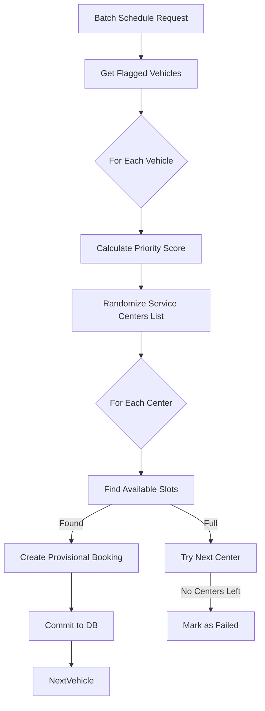

# Scheduling Service Documentation

## 1. Overview
The **Scheduling Service** is the logistical engine of the system. It handles the complex task of assigning vehicles to service centers. It balances multiple constraints: vehicle urgency (severity), customer priority, service center capacity, and operating hours.

## 2. Architecture & Logic

### 2.1 Technology Stack
*   **Framework**: Flask (Python)
*   **Port**: 5003
*   **Database**: SQLite (Shared via SQLAlchemy)
*   **Models**: `Booking`, `ServiceCenter`, `Technician`, `MaintenanceFlag`

### 2.2 Core Logic
The scheduling process involves several sophisticated steps:

1.  **Priority Calculation**:
    Every booking request is assigned a `priority_score` based on weighted factors:
    *   **Severity (40%)**: Critical faults get higher priority.
    *   **Customer Type (20%)**: Fleet/Premium customers get higher priority.
    *   **Proximity (25%)**: (Simulated) Distance to center.
    *   **Wait Penalty (15%)**: Vehicles waiting longer get a boost.
    
    `Score = (Severity * 0.4) + (Customer * 0.2) + ...`

2.  **Service Center Selection (Load Balancing)**:
    To prevent overloading the first scheduled center (e.g., North Delhi), the logic **randomizes** the list of available active service centers before attempting allocation. This ensures a uniform distribution of bookings across the region.

3.  **Slot Finding Algorithm (`get_available_slots`)**:
    *   Iterates through future dates (e.g., next 7 days).
    *   Checks **Operating Hours** (e.g., 09:00 - 18:00).
    *   Checks **Technician Capacity**: Sums existing bookings for a specific hour.
    *   If `current_bookings < capacity_bays`, the slot is deemed available.

4.  **Booking Creation**:
    *   Once a slot is found, a `provisional` booking is created.
    *   The system searches for a specific available `Technician` (optional constraint).
    *   **Critical Fix**: Ensures the `created_at` timestamp is explicitly set and flushed to the DB to prevent serialization errors.

### 2.3 Logic Flow


## 3. Endpoints & API Reference

### 1. Batch Schedule
*   **Endpoint:** `/api/schedule_batch`
*   **Method:** `POST`
*   **Description:** Attempts to schedule a list of vehicles.
*   **Logic:**
    *   Validates vehicle existence and maintenance flags.
    *   Iterates through centers to find the first one with capacity (randomized order).
    *   Updates `MaintenanceFlag.is_scheduled` to True on success.

### 2. Get Available Slots
*   **Endpoint:** `/api/getSlots`
*   **Method:** `GET`
*   **Query Params:** `center_id`, `date`
*   **Description:** Public endpoint to check availability for manual booking overrides.

## 4. Key Code Implementation (Slot Finding)
```python
def get_available_slots(center, start_date, end_date):
    """
    Finds open slots accounting for operating hours and collisions.
    """
    while current_time < end_date:
        if is_within_operating_hours(current_time, center):
            concurrent = count_bookings(center, current_time)
            if concurrent < center.capacity_bays:
                slots.append(current_time)
        
        # Advance by 1 hour
        current_time += timedelta(hours=1)
        
        # Handle end-of-day rollover safely
        if current_time.hour >= closing_time:
            current_time = move_to_next_day_morning(current_time)
```
