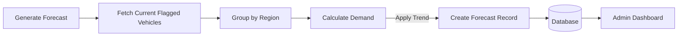

# Forecasting Service Documentation

## 1. Overview
The **Forecasting Service** provides predictive analytics on the *system itself*. While the Core Engine predicts vehicle health, the Forecasting Service predicts **service center demand**. It helps administrators plan resources by estimating future booking volumes based on historical trends and current fleet telemetry.

## 2. Architecture & Logic

### 2.1 Technology Stack
*   **Framework**: Flask (Python)
*   **Port**: 5004
*   **Database**: SQLite (`Forecast` table)

### 2.2 Core Logic
The forecasting logic uses a simplified heuristic model (for this prototype) that can be upgraded to a Time Series model (ARIMA/Prophet) in production:

1.  **Data Aggregation**:
    *   It queries the `MaintenanceFlag` table to see the current backlog of broken vehicles.
    *   It looks at `Booking` history to determine usage rates.

2.  **Regional Prediction**:
    *   Calculates `estimated_requests` for each region (North Delhi, Gurgaon, etc.).
    *   Formula: `Baseline + (Current_Flagged_Count * Regional_Multiplier)`.

3.  **Capacity Utilization**:
    *   Compares the `estimated_requests` against the `ServiceCenter.capacity_bays`.
    *   `Utilization % = (Estimated_Requests / Total_Weekly_Capacity) * 100`

### 2.3 Logic Flow


## 3. Endpoints & API Reference

### 1. Generate Forecasts
*   **Endpoint:** `/api/forecast/generate`
*   **Method:** `POST`
*   **Description:** Triggers the calculation engine to create new forecast records for the next 7 days.
*   **Response:**
    ```json
    {
        "status": "success",
        "generated_count": 5
    }
    ```

### 2. Get Regional Forecasts
*   **Endpoint:** `/api/forecast/regional`
*   **Method:** `GET`
*   **Description:** Returns the latest forecast data tailored for the frontend bar charts (Requests vs Utilization).

## 4. Key Code Implementation
```python
def calculate_utilization(est_requests, center_capacity):
    """
    Calculate simple utilization percentage.
    Assumes 10 working hours * 7 days.
    """
    total_slots_per_week = center_capacity * 10 * 7
    utilization = (est_requests / total_slots_per_week) * 100
    return min(utilization, 100) # Cap at 100%
```
