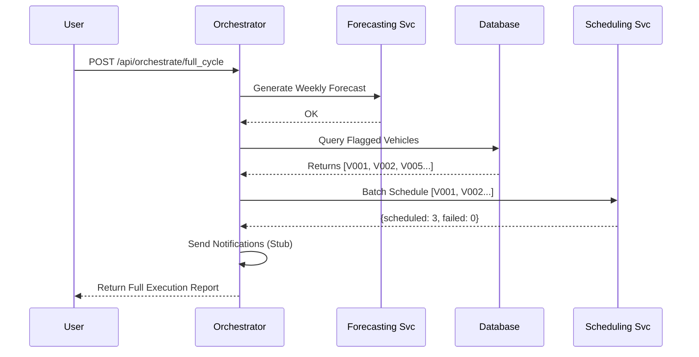

# Orchestrator Service Documentation

## 1. Overview
The **Orchestrator Service** is the "conductor" of the microservices orchestra. It abstracts complex multi-step workflows into single API calls. Instead of the frontend calling Forecasting, then identifying vehicles, then Scheduling, then Notifying... the Orchestrator handles this entire sequence transactionally.

## 2. Architecture & Logic

### 2.1 Technology Stack
*   **Framework**: Flask (Python)
*   **Port**: 5005
*   **Dependencies**: Communicates via HTTP with all other services.

### 2.2 Core Logic
The primary feature is the **"Full Automation Cycle/Run"**:

1.  **Step 1: Forecasting**: Calls Forecasting Service to predict upcoming load.
2.  **Step 2: Identification**: Queries the Database for vehicles flagged with `is_scheduled=False`.
3.  **Step 3: Scheduling**: Bundles these vehicles and POSTs them to the **Scheduling Service** `/api/schedule_batch` endpoint.
4.  **Step 4: Notification**: (Simulated) Sens emails/SMS to owners of successfully scheduled vehicles.
5.  **Step 5: Reporting**: Returns a comprehensive summary of the entire operation.

### 2.3 Workflow Diagram


## 3. Endpoints & API Reference

### 1. Run Full Cycle
*   **Endpoint:** `/api/orchestrate/full_cycle`
*   **Method:** `POST`
*   **Body:** `{"auto_confirm": true}`
*   **Description:** Triggers the end-to-end maintenance workflow.

### 2. Schedule Flagged Only
*   **Endpoint:** `/api/orchestrate/schedule_flagged`
*   **Method:** `POST`
*   **Description:** A subset of the full cycle that skips forecasting and purely focuses on clearing the backlog of flagged vehicles.

## 4. Key Code Implementation
```python
def orchestrate_step(step_name, func):
    """
    Wrapper to handle errors and logging for each step
    """
    try:
        result = func()
        return {"step": step_name, "status": "success", "data": result}
    except Exception as e:
        return {"step": step_name, "status": "failed", "error": str(e)}
```
