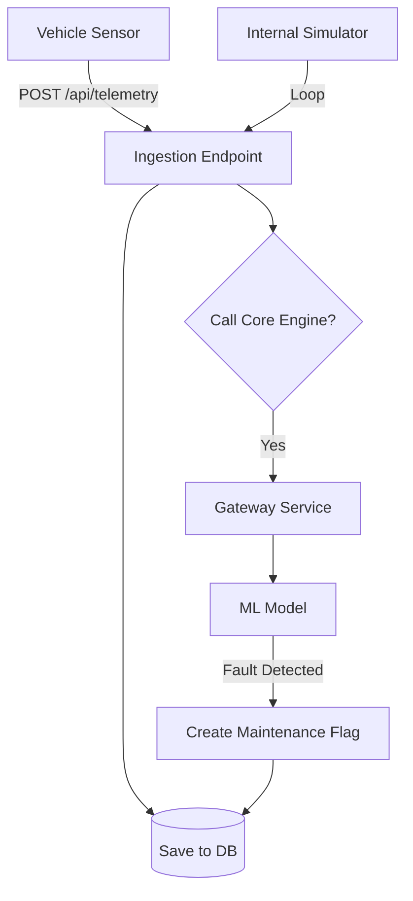

# Telemetry Ingestion Service Documentation

## 1. Overview
The **Telemetry Ingestion Service** is responsible for the intake of raw sensor data from vehicles. It supports high-frequency data ingestion and also includes a **Simulator** to generate realistic test data for the system. Crucially, it acts as the trigger for the reactive maintenance pipeline by sending data to the Core Engine for immediate analysis.

## 2. Architecture & Logic

### 2.1 Technology Stack
*   **Framework**: Flask (Python)
*   **Port**: 5006
*   **Concurrency**: Uses Python `threading` for the background simulator.

### 2.2 Core Logic

#### A. Ingestion Pipeline
1.  **Receive**: Accepts JSON payload with sensor readings (`engine_load`, `oil_quality`, etc.).
2.  **Store**: Saves the raw record to the `Telemetry` table in the database.
3.  **Analyze (The Trigger)**: Immediately forwards this data to the **Gateway/Core Engine** to check for faults.
4.  **Flag**: If the Core Engine predicts a fault, the Telemetry Service creates a `MaintenanceFlag` entry in the database. This flag is what the Orchestrator later looks for.

#### B. Simulator Logic
*   Runs in a separate background thread.
*   Iterates through all registered vehicles.
*   Generates semi-random data based on realistic distributions (e.g., Oil Quality naturally degrades over time).
*   Pushes this data to its own Ingestion API, effectively simulating a fleet of connected cars.

### 2.3 Logic Flow


## 3. Endpoints & API Reference

### 1. Ingest Telemetry
*   **Endpoint:** `/api/telemetry`
*   **Method:** `POST`
*   **Request Body:**
    ```json
    {
        "vehicle_id": "V001",
        "timestamp": "2025-12-15T10:00:00",
        "engine_load": 0.45,
        "oil_quality": 8.5
        ...
    }
    ```

### 2. Simulator Control
*   **Endpoints:** 
    *   `/api/simulator/start`
    *   `/api/simulator/stop`
    *   `/api/simulator/status`
*   **Description:** Controls the background thread that generates mock traffic.

## 4. Key Code Implementation (The "Trigger")
```python
def process_telemetry(data):
    # 1. Save to DB
    save_record(data)
    
    # 2. Real-time Analysis Trigger
    # We call the Gateway to get a prediction
    response = requests.post(
        'http://localhost:5000/predict', 
        json={"features": extract_features(data)}
    )
    
    result = response.json()
    
    # 3. Create Flag if needed
    if result['maintenance_needed']:
        create_maintenance_flag(data['vehicle_id'], result)
```
